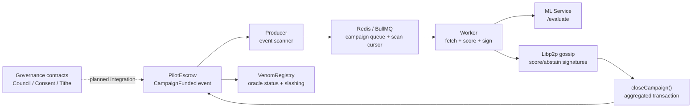

# VENOM Node

VENOM Node is a careful witness for decentralized ML-gated oracle work: it separates local observations, on-chain state, and simulations before presenting operator-facing artifacts.

Decentralized ML-gated oracle node with governance, council, and charitable redirection modules in one project root.

## Status

This is a Base Sepolia testnet project. The contracts are unaudited and should not be used with mainnet funds. The current node still supports a controlled test payload mode while v1.1 real payload fetching is being finished.

Current economic limitations:

- `VenomRegistry.MIN_STAKE` is `1 ETH` on testnet.
- `VenomRegistry.SLASH_PERCENT` is currently `5`.
- `PilotEscrow.fundCampaign()` records the funder as the current campaign recipient, so `closeCampaign()` returns the campaign bounty to that address. Operator bounty payouts are not implemented in the active contract yet.
- Oracle unstaking is not implemented. Slashed stake is tracked in `slashedStakeReserve` and can be withdrawn by the registry owner; remaining active stake stays locked until an unstake flow is added.

## Consolidated Layout

This repository folds the previous side folders into one active project:

- `venom-node` -> runtime node, aggregator, contracts, dashboard, ML service, tests, and Docker setup.
- `venom-council` -> `contracts/governance`, `scripts/governance`, and `docs/governance`.
- `venom-tithe` -> faith-specific governance material in `contracts/governance/faith` and `docs/governance`.

```text
venom-node/
  aggregator/              Node runtime queue, gossip, and worker logic
  contracts/               Hardhat contracts
    PilotEscrow.sol
    VenomRegistry.sol
    governance/            Council, agreement, consent, and tithe contracts
      faith/               Optional faith-specific attestation contracts
  dashboard/               Static operator dashboard
  data/prompts/            Small prompt-audit fixtures
  docs/                    Operator, roadmap, architecture, and governance notes
  eval_engine/             Python evaluation and audit harnesses
  ml_service/              FastAPI scoring service
  rpc/                     RPC/router helpers
  scripts/                 Deployment and demo scripts
  test/                    Hardhat tests
```

## Quick Start

```bash
npm install
cp .env.example .env
npm run compile
npm test
npm run roadmap:check
```

For the full local node stack:

```bash
docker compose up -d --build
```

Redis and the ML service are bound to `127.0.0.1` by default, not exposed on all host interfaces.

## Component Integration Smoke Test

The CIST v1.1 harness exercises the fixture-mode lifecycle from config preflight through report teardown.

Run it from the repo root:

```bash
npm run pilot:smoke-test
```

Relevant files:

- [scripts/pilot/smoke-test.js](scripts/pilot/smoke-test.js) is the CLI entrypoint.
- [scripts/pilot/cist/report.js](scripts/pilot/cist/report.js) builds `report.json` and `report.md`.
- [tmp/smoke-test/latest.txt](tmp/smoke-test/latest.txt) records the latest run ID in this checkout.

Fixture mode accepts `--scenario=all-agree`, `--scenario=mixed`, and `--scenario=with-abstain`; in v1.1 they all execute the same fixture path and produce the same overall PASS result.

## Quick Architecture Overview



## Common Commands

```bash
npm run start
npm run venom -- status
npm run doctor
npm run compile
npm test
npm run coverage
npm run demo:governance
npm run deploy:phase4
npm run deploy:tithe
```

`deploy:phase4` and `deploy:tithe` use `base-sepolia` and read `RPC_URL` plus `DEPLOYER_PRIVATE_KEY` from `.env`.

## Core Contracts

- `contracts/VenomRegistry.sol` - oracle registration, active oracle lookup, and slashing reserve accounting.
- `contracts/PilotEscrow.sol` - campaign funding, EIP-712 score/abstain verification, quorum checks, campaign close/cancel.

## Governance Layer

The v0.3 governance layer is compiled and tested with the main project:

- `contracts/governance/CouncilRegistry.sol` registers worldview branches, validators, attestations, and top-validator slices.
- `contracts/governance/AgreementFactory.sol` creates cross-branch `MinimalMultiSig` agreements when top validators have enough attestation overlap.
- `contracts/governance/MinimalMultiSig.sol` is a small k-of-m wallet for synthetic collaboration entities.
- `contracts/governance/ConsentManager.sol` stores per-user charitable redirection preferences.
- `contracts/governance/TitheManager.sol` queues configurable charitable redirection amounts as claimable pull payments for bounded active recipients.
- `contracts/governance/faith/CreedValidator.sol` is an optional faith-specific attestation module.

`ConsentManager` and `TitheManager` are not yet wired into `PilotEscrow.closeCampaign()`. The intended integration is: read the campaign participant's consent preset, compute an effective charitable redirection rate, route that portion through `TitheManager`, and let recipients claim queued balances. Until that integration lands, they are deployable governance modules exercised by tests and the demo script, not active escrow payment logic.

The active `TitheManager` is the worldview-agnostic version. The older Christian-specific tithe contract is preserved as documentation in `docs/governance/legacy-christian-tithe-manager.sol.txt` so compiler scans cannot pick up two `TitheManager` contracts.

## Runtime Notes

- Docker Compose starts Redis, the ML service, and the node runtime.
- `aggregator/worker.js` can run in `USE_TEST_PAYLOAD=true` mode until real payload fetching is production-ready.
- `aggregator/p2p.js` elects the aggregate transaction submitter from the current score-signer set and rotates to the next score signer after `P2P_LEADER_TIMEOUT_MS`.
- `dashboard/index.html` is a static local dashboard.
- Use a dedicated low-balance hot wallet for node operation. Never use a primary wallet or cold-storage key in `.env`.

## More Docs

- [Architecture](docs/ARCHITECTURE.md)
- [Operator Guide](docs/OPERATOR_GUIDE.md)
- [Roadmap](docs/ROADMAP.md)
- [Project Structure](docs/PROJECT_STRUCTURE.md)
- [Governance Notes](docs/governance/council.md)
- [Escrow/Governance Integration Plan](docs/governance/PILOT_ESCROW_INTEGRATION.md)

Generated folders such as `artifacts`, `cache`, and `node_modules` are ignored.
