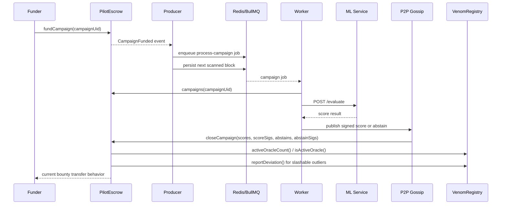

# Architecture

VENOM Network has three cooperating layers.

## On-Chain Layer

`VenomRegistry` stores oracle stake, active status, multiaddrs, and slashing reserve accounting.

`PilotEscrow` stores funded campaigns and verifies EIP-712 score and abstain signatures. It applies absolute score quorum, score-quorum percentage, and total participation floor checks before closing a campaign.

`contracts/governance/` contains the council and charitable redirection modules. These are independent from the current escrow payment path until an explicit integration is added.

## Node Runtime

`register_and_start.js` validates environment variables, registers the node if needed, starts Libp2p, starts the campaign producer, and starts the BullMQ worker.

`aggregator/producer.js` scans `CampaignFunded` events and queues work.

`aggregator/worker.js` fetches or supplies payload data, calls the ML service, signs score or abstain messages, and publishes them to the P2P topic.

`aggregator/p2p.js` gossips oracle messages and submits an aggregated `closeCampaign` transaction when the local node is the deterministic testnet leader.

## ML Layer

`ml_service/main.py` exposes a FastAPI `/evaluate` endpoint and keeps the semantic model warm in memory.

The Python `eval_engine/` tools are offline calibration and audit utilities. They are not required for the Docker node runtime except for the scoring module imported by the ML service.

## Campaign Close Flow

The producer stores the next block cursor in Redis, keyed by escrow address. If the node restarts, it resumes from that cursor instead of falling back to only the last 200 blocks.

## Governance Payment Integration

`ConsentManager` and `TitheManager` currently run beside the escrow path. A future escrow integration should:

1. Determine whose consent setting applies to the payment.
2. Read the effective rate from `ConsentManager`.
3. Route the charitable portion through `TitheManager`.
4. Queue claimable balances for the charitable recipients and net campaign recipient.
5. Emit events that indexers can reconcile with the original campaign close and later claims.
